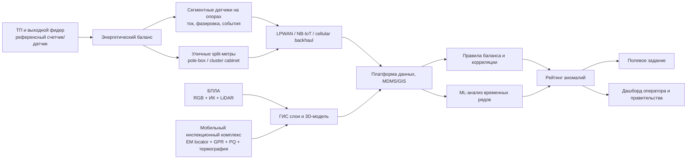
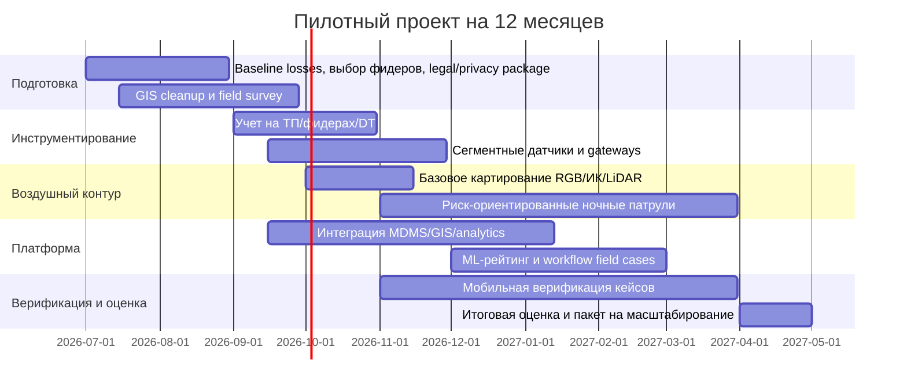

# Наружная система обнаружения и локализации хищений электроэнергии в районах без бытовых счетчиков

## Executive summary

В районах, где у домохозяйств нет индивидуальных счетчиков и инспекторы не могут безопасно заходить в дома, наиболее надежная стратегия не состоит в одном “чудо-датчике”. Рабочая архитектура должна быть многоуровневой: опорный учет на ТП и фидерах, сегментация сети датчиками на опорах или по улицам, выборочное вынесение учета в уличные или столбовые шкафы, дроны как слой локализации и визуально-теплового подтверждения, и мобильные наземные комплексы для дообследования и доказательной фиксации. Такой переход от контроля внутри дома к контролю по физическим параметрам сети соответствует и логике вашего приложенного концепта. fileciteturn0file0L16-L17

Главный вывод исследования: для государственного пилота не стоит начинать с полной уличной “счетчиковой революции” или, наоборот, только с дронов. Наилучший стартовый стек для зон высокого риска выглядит так: обязательный учет на ТП и выходных фидерах, датчики на части опор в “красных” сегментах, дроны с RGB/ИК/по возможности LiDAR для картирования и ночной локализации, и мобильная группа с переносными средствами ЭМ- и GPR-локализации для подземных отпайкок и спорных случаев. Полноценные уличные или столбовые split-метры надо включать точечно, там где поселение относительно стабильно и государство одновременно хочет не только ловить хищения, но и легализовать потребление. citeturn24view2turn24view5turn44view0turn24view6turn24view7turn24view1

По точности локализации архитектуры различаются радикально. Баланс на уровне фидера или трансформатора обычно указывает только проблемную улицу, ветвь или зону. Сегментные датчики на опорах позволяют сузить поиск до пролета, группы ответвлений или квартала. Уличные кластерные счетчики и pole-box split-метры дают лучшую точность до дома или группы домов. Дрон может локализовать тепловую или визуальную аномалию практически до метра на местности, но не заменяет сетевой баланс и сам по себе не доказывает незаконность подключения: он показывает перегрев, подозрительную геометрию проводов или след скрытого маршрута. Подземные кабели и скрытые отпайки окончательно локализуются мобильными ЭМ-локаторами и GPR, а не одной аэрофотосъемкой. citeturn24view8turn47view0turn24view9turn32view1turn32view0

Международные кейсы подтверждают логику комбинированного подхода, хотя публичных внедрений именно для сценария “без бытовых счетчиков и без допуска в дом” немного. В Ямайке ESMAP и JPS сообщили, что около четверти произведенной электроэнергии терялось из-за хищений и ошибок, и применили открытый ML-модуль для выявления аномалий. В Индии государственная схема RDSS прямо финансирует communicating metering на уровне фидеров и распределительных трансформаторов для снижения потерь. В Южной Африке практика electrification informal settlements показала, что split-метры с активной частью в pole boxes снижают возможность вмешательства, а Eskom отдельно указывает на value tamper alarms и remote reporting. В Бразилии регулятор ANEEL оценил ущерб от “gatos” в 2024 году в R$10,3 млрд и использует регуляторные ориентиры по потерям, не навязывая одной-единственной технологии борьбы. citeturn24view1turn24view2turn44view0turn24view5turn30view0

Для правительства практический приоритет должен быть таким: сначала создать юридически и технически корректную систему внешнего энерго-баланса и ГИС-топологии, затем запускать риск-ориентированные патрули и адресную верификацию, и только потом масштабировать уличный учет и правоприменение. Самая частая ошибка в подобных программах состоит в попытке запускать “черный ящик ИИ” без качественной топологии, без опорного баланса и без нормальных протоколов полевой верификации. Современные обзоры ETD прямо указывают на дефицит качественных размеченных датасетов и на то, что generalized AI-подходы без сильной инженерной и топологической основы дают ограниченную переносимость. citeturn14search0turn14search4turn14search5turn14search21

Ниже суммирован рекомендуемый базовый стек для пилота.

| Слой | Что ставить первым | Роль в системе | Почему это приоритетно |
|---|---|---|---|
| Опорный баланс | Счетчики/датчики на ТП и выходных фидерах | Базовый энергетический баланс, выделение “красных” ветвей | Без upstream-референса все остальные сигналы хуже интерпретируются |
| Сегментация | Датчики на части опор и/или на промежуточных участках улиц | Сужение зоны поиска до улицы, пролета, группы ответвлений | Лучшая цена/эффект для районов без доступа в дома |
| Адресная точность | Уличные split-метры и pole-box cabinets в стабильных зонах | Точность до дома или малой группы домов, возможность легализации | Самая сильная доказательная база, но выше CAPEX и социальная чувствительность |
| Воздушная локализация | Дроны RGB + тепловизор, при бюджете LiDAR | Ночные патрули, картирование, поиск скруток, неучтенных трасс | Хорошо работает как слой подтверждения и безопасности |
| Наземная верификация | Мобильный комплекс с ЭМ-локатором, GPR, переносным PQ-анализатором | Дообследование скрытых кабелей, спорных зон, подземных отпайкок | Необходим для завершения кейсов и снижения false positives |

Источник для базовой логики многослойного стека: World Bank, ESMAP, RDSS India, South Africa informal electrification practice, vendor docs по line/DT monitoring и drone payloads. Локализационная градация по строкам частично является инженерным выводом автора и подлежит проверке на пилоте. citeturn24view2turn24view1turn44view0turn24view6turn24view7turn24view8turn32view1

## Рамка задачи и ключевой вывод

Проблема на языке энергетики выглядит так: потери в распределении это разница между энергией, вошедшей в сеть, и полезной энергией, которая либо учтена, либо не учтена. World Bank и IDB разделяют потери на технические и нетехнические; нетехнические включают кражу, неучтенное потребление, ошибки учета и административные дефекты. Британские DNO прямо определяют non-technical losses как полезно потребленную, но неоплаченную энергию, а также отдельно подчеркивают роль ошибок по unmetered supplies и conveyance errors. Для вашего сценария это критично: не вся “аномалия баланса” равна именно кражe, особенно в районах с уличным освещением, насосами, рекламными щитами, неактуальной ГИС и меняющейся топологией. citeturn26view2turn46view0turn39view0turn39view1

Ключевой сдвиг в голове: проект надо формулировать не как “чем заменить домашний счетчик”, а как “как создать доказуемый внешний цифровой двойник низковольтной сети, достаточный для приоритизации, локализации и безопасной верификации”. Внешний контроль не обязан измерять каждую квартиру с первого дня. Ему достаточно последовательно уменьшать неопределенность от ТП к улице, от улицы к опоре, от опоры к ответвлению, и затем передавать уже узко локализованный кейс мобильной группе. Именно такую логику показывают и государственные программы фидерного/DT-учета, и практики pole-box split metering, и utility use of drones for line inspection. citeturn24view2turn44view0turn24view5turn31search1turn31search2

Что известно достаточно надежно. В emerging economies AMI и smart-grid инструменты внедряются главным образом ради надежности, системной эффективности и revenue collection. World Bank также отмечает, что AMI особенно эффективно усиливает revenue collection и дает utility двусторонние данные, power quality, outage identification и tamper-resistant monitoring. При этом Bank подчеркивает, что внедрение AMI сложно из-за governance, interoperability, compatibility и security. Эти выводы нельзя механически переносить на ваш сценарий, но они полезны как ориентир: государственный пилот должен быть прежде всего программой revenue assurance и grid visibility, а не только “анти-воровским гаджетом”. citeturn37view2turn37view1

Что выводится логически. Если дома недоступны и счетчиков нет, то наибольший эффект дает не дорогой адресный контроль каждого ввода, а ранжирование зон по losses-per-feeder, затем пошаговое уплотнение наблюдаемости. Из этого следует и стратегический приоритет: сначала баланс и топология, потом сегментация, потом дроны и наземная верификация, и только в некоторых подрайонах полный вынос учета наружу. Этот вывод основан на комбинации официальных case studies и инженерной логики сетевого баланса. citeturn24view2turn24view1turn44view0turn30view0

Что пока не уточнено и должно обрабатываться как допущение в ТЭО: плотность застройки, доля воздушных и подземных линий, длина фидеров, фактическая структура уличных ответвлений, наличие связи на опорах, доля нестабильных поселений, юридический режим съемки с БПЛА и допустимость измерений как доказательства. Поэтому ниже все оценки точности локализации и бюджета даны в сценарной форме, а не как “одна правильная цифра”.

## Архитектуры внешнего контроля

Ни одна архитектура не закрывает задачу целиком. Сравнивать надо не “датчики против дронов”, а комбинации по трем критериям: глубина наблюдаемости, точность локализации и стоимость перехода к адресному правоприменению. Технологически доступные опции хорошо видны в современных utility line sensors, transformer monitors, split-meter practice и UAS payloads. citeturn24view6turn24view7turn24view5turn24view8turn24view9

С инженерной точки зрения архитектуры надо разделить на пять классов.

| Архитектура | Что реально измеряет | Типичная зона локализации | Сильные стороны | Ограничения | Где лучше всего работает |
|---|---|---|---|---|---|
| Датчики на ТП и выходных фидерах | Вход/выход энергии, токи/напряжения, события, иногда PQ | Фидер, улица, ветвь | Низкий CAPEX на единицу охвата, база для всего остального | Не дает дом-level attribution | Старт пилота и ранжирование hot spots |
| Датчики на опорах и промежуточных секциях | Ток по фазам, фазировка, температура проводника, fault/non-fault events, waveform snippets | Пролет, группа ответвлений, часть улицы | Лучшее соотношение цена/локализация | Требует сетевой топологии и монтажа на множестве точек | Воздушные LV/MV участки с массовыми набросами |
| Уличные счетчики и split/pole-box meters | Учет по дому или малой группе домов, tamper alarms | Дом, box, группа 1-9-27 подключений | Наилучшая точность и revenue control | Социально и юридически чувствительнее, выше CAPEX, уже частично “формализация учета” | Стабильные поселения, программы легализации и prepayment |
| БПЛА с RGB/ИК/LiDAR | Геометрия линии, тепловые аномалии, неучтенные провода, 3D routes | Метрическая привязка аномалии на местности | Быстрый охват, безопасный осмотр, особенно ночью | Не отделяет законную высокую нагрузку от кражи без сетевого контекста | Локализация, картирование, ночные патрули |
| Мобильные инспекционные комплексы | Подземные/скрытые трассы, точечные PQ и ЭМ сигналы, field evidence | Метры, конкретный кабель/маршрут | Лучший “last mile” для спорных кейсов | Медленнее и дороже на охват, требует обученной группы | Подземные отпайки, спорные зоны, доказательная верификация |

Функциональные возможности этих классов прямо подтверждаются официальными и первичными источниками: Sentient MM3 заявляет измерение current, conductor temperature, voltage characteristics, GPS and waveform capture; Franklin DTM отслеживает per-phase current, voltage, temperature and power factor; Hubbell line post sensors меряют voltage/current без отключения линии; Eskom и практика South Africa informal settlements подтверждают ценность split metering с вынесением активной части в pole boxes; DJI и связанные payloads дают метрическую привязку, тепловую съемку и высокоточную LiDAR-модель. Локализация по строкам таблицы является инженерным выводом автора из этих capabilities и должна быть калибрована на пилоте. citeturn24view6turn24view7turn40view3turn24view5turn44view0turn24view8turn47view0turn24view9

Практически это приводит к простой рекомендации. Если бюджет ограничен, стартовать надо с фидерного и DT-учета плюс сегментация на части опор. Если задача еще и политическая, то есть правительство хочет переводить зоны informal supply в легальное потребление, тогда в стабильных подрайонах надо сразу проектировать pole-box split metering. Если доля скрытых подземных отпайкок высока, то без мобильных ЭМ/GPR-комплексов дроны и опорные датчики не доведут кейс до уверенной локализации. citeturn24view2turn44view0turn32view1

## Измерения и аналитика обнаружения

### Что именно измерять

Для сценария “без бытовых счетчиков” есть соблазн измерять как можно больше. Это ошибка. Нужен минимально достаточный набор, который дает энергетический баланс, топологическую согласованность и событийную локализацию. Базовыми являются токи по фазам, напряжение в опорных точках, фазировка/phase angle, активная и реактивная мощность, power factor, события sag/swell/fault, температура проводников и соединений, а также актуальная топология воздушных и подземных путей. Гармоники и подробные waveform captures важны, но как вторичный слой, а не как первичный детектор. citeturn24view7turn24view6turn40view0turn23search2turn24view14

| Параметр | Зачем нужен | Где мерить | Рекомендуемая периодичность | Требуемая точность |
|---|---|---|---|---|
| Ток по фазам | Основа баланса и сегментации | ТП, фидер, опора, pole-box | 1-5 мин телеметрия; 1 с вокруг событий | screening: класс 0.5-1 экв.; enforcement лучше 0.5 |
| Напряжение | Нормализация нагрузки, sag/swell, поиск нелегального отбора и перегруза | ТП, фидер, часть опор, pole-box | 1-5 мин; событийный архив | PQ-grade в опорных точках, иначе engineering-grade |
| Фазировка и phase angle | Проверка topology consistency, перекосы, незаконные перескоки | ТП и сегментные точки | при вводе в эксплуатацию + при событиях | синхронизация по времени обязательна |
| P/Q/S, cos φ | Уточнение характера нагрузки | ТП, DT, pole-box | 1-5 мин | meter-grade |
| Гармоники, THD/TDD | Вторичный сигнал “нетипичной” электроники и плохих соединений | ТП, DT, отдельные проблемные сегменты | 10-мин агрегаты + event capture | по IEC 61000-4-30 / IEEE 519 на PCC |
| Температура проводника/контакта | Локализация скруток, перегретых соединений, ночных пиков краж | line sensors, дроны, мобильная термография | line sensor 1-5 мин; drone risk-based | относительная аномалия важнее абсолютной |
| Residual/neutral current, leakage | Признак нелегальных схем и unsafe wiring | DT, pole-box, мобильная проверка | 1-5 мин / по кейсу | зависит от схемы сети |
| Геопривязка и topology layer | Без нее нельзя локализовать кейс | ГИС, LiDAR, field survey | базовое картирование + обновление по изменениям | для LiDAR 4-5 см; для aerial route map лучше <0,2 м |

Нормативный ориентир для power quality measurements, если данные должны иметь регуляторную или доказательную силу, это IEC 61000-4-30 Class A или его национальный эквивалент. Российский ГОСТ IEC 61000-4-30-2017 прямо задает методы измерения показателей качества электроэнергии и порядок интерпретации результатов, чтобы обеспечить достоверность и повторяемость. Для гармоник на точке общего присоединения используется подход IEEE 519. Базовые интервалы агрегирования в IEC-практике составляют 10/12 cycles, 150/180 cycles и 10 minutes, а для flicker long-term используется 2-hour interval. citeturn24view14turn23search2turn23search6

Для retrofits без отключения линии наиболее практичны split-core CT и Rogowski coils. Eaton указывает, что split-core CT удобны для retrofits, работают в диапазоне 10-130% rated current, а отдельные модели имеют 0.5% accuracy. Janitza для Rogowski coil заявляет retrospective clip-on installation without disconnecting the phase conductor, class 0.5, high linearity, no saturation, до 700 kHz bandwidth и работу в широком температурном диапазоне. LEM дополнительно показывает utility-use line sensors на базе split-core Rogowski coil и отмечает измерение amplitude and phase of current, conductor surface temperature и fault detection. Это делает Rogowski особенно привлекательным для быстрых пилотов на существующей сети, а split-core CT полезным там, где нужны более привычные метрологические схемы и меньше требований к внешнему преобразователю. citeturn40view2turn40view1turn40view0

### Какие алгоритмы реально работают

Для государственного проекта я рекомендую не “один ML-классификатор”, а каскад из четырех слоев.

| Слой аналитики | Что делает | Что нужно на входе | Сильная сторона | Главный риск |
|---|---|---|---|---|
| Баланс фидера/DT | Считает небаланс между upstream и downstream | референсные измерения на ТП/DT и хотя бы частично ниже по сети | простота, объяснимость, быстрый старт | не отличает theft от topology/data errors |
| Сравнение сегментов и фидеров | Ищет нетипичные load-shapes и зоны с непропорциональным ростом | сегментные датчики, календарь, weather, known legal loads | хороший screening на улицу/квартал | чувствителен к сезонности и скрытым легальным нагрузкам |
| Распределенная корреляция и топологическая проверка | Сопоставляет time-series между соседними точками и геометрией сети | time-sync, GPS, фазировка, GIS graph | резко улучшает локализацию | требует хорошей модели сети |
| ML-рейтинг аномалий | Ранжирует кейсы по вероятности при field capacity constraints | history, confirmed cases, engineered features | снижает нагрузку на инспекцию | label scarcity, concept drift, poor transferability |

Современные обзоры data-driven ETD сходятся в двух вещах. Во-первых, модели чувствительны к качеству датасета, дисбалансу классов и слабой переносимости между территориями. Во-вторых, лучший практический эффект дают гибридные подходы, где upstream master meter или transformer-side meter используется как референс, а ML не заменяет баланс, а лишь ранжирует аномалии. Именно поэтому в вашем контексте black-box supervised classifier на старте не является приоритетом. Приоритетом является graph-aware anomaly system с ручной верификацией первых сотен кейсов. citeturn14search0turn14search4turn14search21turn24view1

Геопривязка должна быть не “красивой картой”, а частью детектора. CIRED-подходы к NTL и spatiotemporal regional estimation показывают, что пространственные признаки улучшают action planning и снижают inspection cost. В вашей задаче это означает следующее: каждая аномалия должна храниться не только как timestamp и percent imbalance, но и как segment ID, pole span, distance from transformer, thermal image link, last topology survey, nearby unmetered public loads и field outcome. Без этого даже хороший ML не будет управляемым на уровне правительства. citeturn22search15turn22search10

Практическое правило по частоте съема такое. Для постоянной телеметрии достаточно 1-5 минут на current/voltage/power, если в устройстве есть локальный буфер событий и возможность сохранить high-resolution waveform around anomalies. 10/12-cycle и 150/180-cycle окна не надо непрерывно гонять по LPWAN, их надо использовать как локальный event recorder. Для тепловизионного слоя достаточно базовой карты и затем риск-ориентированных патрулей. Это не прямое требование стандарта, а инженерная рекомендация, выведенная из стандартных PQ intervals и ограничений LPWAN backhaul. citeturn23search6turn24view6turn26view1

## Развертывание, связь и операции

### Монтаж и питание

Внешние и “безвходовые” датчики возможны технически. Hubbell прямо указывает, что line post sensors могут ставиться без de-energize и без cut the main conductor. Rogowski и split-core CT ориентированы на retrospectives installation. Это означает, что пилот можно разворачивать без массированных отключений и без входа в частные владения. Для опорных сегментов это критическое условие выполнимости. citeturn40view3turn40view1turn40view2

По питанию есть три реалистичных режима. Первый, line-powered, лучше всего подходит для постоянных датчиков на линиях и трансформаторах, потому что снимает проблему battery theft, сезонного обслуживания и падения связи в “горячих” районах. Второй, battery-first LPWAN, полезен для редких sensor points и автономных boxes. Третий, solar-assisted, разумен только там, где есть открытый доступ к солнцу и низкий риск вандализма. Задача правительства должна формулироваться так: минимизировать число полевых выездов на замену батарей в небезопасных районах. 3GPP для eMTC и NB-IoT использует ориентир порядка 10 лет работы от 5 Wh battery при соответствующем traffic pattern and coverage, но в реальной сетевой эксплуатации этот показатель надо рассматривать как теоретический потолок, а не как SLA. citeturn24view17turn26view0

### Связь

| Вариант связи | Что дает | Где использовать | Ограничение |
|---|---|---|---|
| LoRaWAN | private utility network, low power, хороший fit для meters and grid monitoring | массовые low-data сенсоры на опорах | нужен собственный gateway footprint и discipline в RF design |
| NB-IoT | extended coverage, huge device density, low power на сети оператора | там, где есть cellular coverage и utility не хочет строить private RF | зависимость от оператора и тарифной модели |
| 4G/5G | высокий bandwidth и простая интеграция backhaul | gateways, pole concentrators, drone docks, mobile teams | дороже и избыточно для большинства endpoint sensors |
| Mesh / point-to-point RF | локальная устойчивость и utility-owned path | компактные urban clusters | сложнее эксплуатация и планирование |

3GPP для NB-IoT задает до 164 dB maximum coupling loss, ориентир 10-year battery life и поддержку порядка 50,000 devices per cell. LoRa Alliance и ABI прямо отмечают, что LoRaWAN и NB-IoT не обязаны конкурировать лоб в лоб: они могут сосуществовать, а utilities smart metering and grid monitoring являются одним из естественных use cases. Для вашей задачи это переводится в простую архитектуру: endpoint telemetry на LoRaWAN или NB-IoT, backhaul gateways и видеоданных на 4G/5G, а imagery и 3D models не надо тянуть через LPWAN. citeturn24view17turn26view0turn26view1

### Дроны и полевой режим

Официальные utility and aviation sources хорошо показывают, что беспилотники надо ставить в операционную роль, а не в роль “основного счетчика”. DJI Matrice 4T и Zenmuse H30T обеспечивают тепловизионный слой, spot and area temperature measurement, 30 Hz thermal video, а лазерный дальномер дает дальность и метрическую привязку. Zenmuse L2 дает 4 cm vertical accuracy и 5 cm horizontal accuracy для aerial LiDAR mapping. Это делает UAV отличным инструментом для картирования трасс, поиска лишних проводов, thermal hot spots и подтверждения того, где именно физически находится аномалия. Но legality по нему не выводится автоматически. citeturn24view8turn47view0turn24view9

Для операций целесообразен такой режим. Сначала делается базовое аэро-картирование всей пилотной зоны и построение “эталонной” 3D/GIS-модели. Затем по hot feeders вводятся ночные ИК-патрули не реже 1 раза в неделю, а в peak theft hours, например в вечернем и ночном окне, 2-3 раза в неделю для действительно проблемных участков. После storm events, topology changes или кампаний подключения делается внеплановый облет. Российская практика “Россети Сибирь” подтверждает utility-value БПЛА для ускорения визуальных обследований линий и более быстрого устранения дефектов, а в стандартах “Россети” применение БПЛА для обследования ВЛ уже институционализировано. Это не антихищенческий кейс в чистом виде, но очень важный operational precedent на русском языке. citeturn31search1turn31search2turn19search4

### Кибербезопасность и защита от саботажа

Для внешних датчиков и уличных шкафов нужна не “общая ИБ”, а четкий procurement baseline. NIST SP 800-213A определяет каталог IoT device cybersecurity capabilities, а NIST IR 8259A отдельно подчеркивает secure software update by authorized entities, verification/authentication update packages и device-level capabilities. NISTIR 7628 дает общий framework по smart grid cybersecurity. Это означает, что государственный пилот должен закупать только такие устройства и платформы, которые поддерживают device identity, signed firmware, secure update, event logging, data protection и управляемый lifecycle поддержки. citeturn24view12turn35search0turn35search2turn24view13

С точки зрения физической защиты наилучший набор мер таков: высотный монтаж вне легкого доступа, антивандальный корпус, hidden cabling where possible, хэшируемые журналы событий, вскрытие корпуса как отдельное событие, резервирование критических точек измерения и регулярная сверка topology layer с drone imagery. Там, где вводится уличный split metering, tamper alarms и anti-bypass reporting должны быть частью базового ТЗ, а не опцией “если будет бюджет”. Eskom официально подчеркивает reduced theft and fraud именно из-за anti-tampering technology и tamper alarms, linked to utility system. citeturn24view5

### Право, privacy и safe use

Для drone ops в европейской нормативной логике многие utility-infrastructure missions попадают не в open, а в specific category, если выходят за базовые open limitations. EASA также прямо требует встраивать privacy and data protection principles в operations manual, procedures and policies. Для правительственного проекта из этого вытекают два практических правила. Первое: все полеты и image processing должны идти по утвержденному SOP, с минимизацией не относящихся к делу персональных данных и сроков хранения. Второе: aerial imagery должна быть “операционным доказательством для локализации”, а санкционные решения должны опираться еще и на сетевой баланс, GIS topology, акт полевой верификации и соблюдение chain of custody по данным. Это уже не только техника, но и governance design. citeturn24view10turn24view11

## Практика внедрений, право и этика

Публичные внедрения редко описывают exactly тот же сценарий, который интересует вас. Но соседние кейсы дают достаточно материала, чтобы сформировать государственную стратегию.

| Страна / организация | Что внедрено | Что важно для вашего проекта |
|---|---|---|
| Ямайка, JPS + ESMAP | ML-модель для поиска theft-related anomalies; open source code | показывает, что сетевой и потребительский anomaly screening масштабируется и может быть воспроизводимым |
| Индия, Ministry of Power RDSS | smart metering + system metering at feeder and DT level with communicating feature, TOTEX PPP | государство может финансировать не только household meters, но и систему внешнего баланса |
| Индия, Tata Power-DDL | long-run loss reduction, 5.54% AT&C к марту 2025, 5.75 lakh smart meters | loss reduction работает как программа инфраструктуры, аналитики и governance, а не как разовая кампания |
| Южная Африка, informal settlement electrification + Eskom | split-type meters in pole boxes preferred; smart prepaid split meters with tamper alarms | лучший публичный прецедент вынесения активной части учета наружу в сложных районах |
| Бразилия, ANEEL | регулирует и мониторит losses, в 2024 ущерб от “gatos” R$10.3 bn | государство может задавать targets and incentives, не навязывая одну технологию |
| Великобритания, UKPN и SP Energy Networks | формализуют NTL как theft + UMS + misallocation/conveyance errors | полезно для регуляторной классификации кейсов и исключения ложных обвинений |
| Россия, Россети | institutional use of UAV for line survey and dedicated standards | русскоязычный precedent для беспилотного контура и безопасного обследования сети |

Подтверждение по строкам таблицы: ESMAP сообщает, что около четверти electricity in Jamaica was stolen or lost and that the implemented model is open source; RDSS explicitly funds feeder and DT communicating metering; Tata Power-DDL зафиксировала снижение AT&C losses с 53% в 2002 году до 5.54% в 2025-м; South African practice рекомендует split-type meters with active units mounted in pole boxes and documents maypole/pole-box architectures; Eskom официально пишет о tamper alarms; ANEEL оценивает ущерб от theft-related losses и использует regulatory limits; UKPN и SPEN формализуют administrative/unmetered/theft categories; Rosseti documents UAV use in line inspection. citeturn24view1turn24view2turn24view3turn44view0turn24view5turn30view0turn39view0turn39view1turn31search1turn31search2

Из этих кейсов следует важный государственный урок. Успешные программы управления потерями почти никогда не ограничиваются только детектором. Они объединяют measurement, GIS/topology, billing-governance, field enforcement, customer regularization и regulatory incentives. В Latin America and the Caribbean IDB прямо подчеркивает, что loss-reduction требует prioritization of investments, data flows and management systems, а в эквадорском кейсе успех связывается с мониторингом причин потерь, мерами против theft и digitization of metering and billing. citeturn46view0turn46view1

Этический предел такого проекта простой. Целью должен быть не “тотальная слежка за бедными районами”, а перевод небезопасного и неучтенного потребления в управляемый, легальный и более безопасный режим. Южноафриканский опыт informal electrification показывает, что технологический подход без community engagement не решает проблему: removed illegal wiring can reappear within days, и neither technological approaches alone nor periodic clearing is adequate. Это критично для вашего предложения правительству: контур выявления надо сразу связывать с контуром легализации, социального тарифа и безопасного подключения. citeturn44view0turn45view1

## Экономика, риски и масштабирование

### Что известно по стоимости, а что является допущением

На рынке мало публичных и сопоставимых цен именно на ваш набор решений, поэтому бюджет ниже носит сценарный характер. В качестве якорей можно опереться на два официальных ориентира. World Bank для своего портфеля AMI-проектов указывает средний порядок installed cost smart meter около $240, хотя вариативность велика. Южноафриканская практика informal settlement electrification показывает, что полноценное household connection может стоить порядка R8,000-R12,000 на дом, то есть сетевые и организационные затраты часто намного важнее цены самого счетчика. Следовательно, для вашего сценария самые дорогие элементы это не столько sensor hardware, сколько выносной учет в уличные box’ы, GIS cleaning, operations, связь, правовой контур и field verification. citeturn37view2turn44view0

### Сравнение вариантов по цене, масштабу и локализации

В таблице ниже CAPEX и localization range являются инженерной оценкой автора для ТЭО, а не коммерческой котировкой. Они опираются на официально доступные классы оборудования и case anchors, но должны быть перепроверены через RFI/RFP.

| Вариант | Относительный CAPEX | OPEX | Масштабируемость | Типичная точность локализации | Комментарий |
|---|---:|---:|---|---|---|
| Только ТП/фидерный баланс | Низкий | Низкий | Очень высокая | улица / ветвь / feeder | хороший первый фильтр, плохая адресность |
| Баланс + сегментные датчики на опорах | Средний | Средний | Высокая | пролет / квартал / группа домов | лучший стартовый компромисс |
| Баланс + уличные split-метры | Средне-высокий | Средний | Средняя | дом / ящик / малая группа | лучшая адресность и billing outcome |
| Дроны без наземных датчиков | Средний | Средний | Высокая по охвату | метрическая аномалия, но слабая юридическая атрибуция | не рекомендуется как единственный слой |
| Дроны + датчики + мобильная верификация | Высокий, но управляемый | Средне-высокий | Высокая при risk-based routing | от улицы до дома, в underground cases до точного маршрута | лучший вариант для пилота высокой значимости |

### Сценарная оценка точности

Если пилот построен только на фидере и DT, то realistic target это уверенное выделение проблемной улицы или части поселка. Если добавлены сегментные датчики через каждые 100-250 м в плотной воздушной сети, то median localization radius можно целиться в 20-80 м, а в благоприятной topology even better. Если используются pole-box street meters или адресные branch CTs на каждом обслуживаемом ответвлении, то локализация может быть доведена до дома или небольшой группы домов. Для UAV thermal/RGB локализация физической аномалии обычно метрическая благодаря own-positioning и laser range tools, но attribution к конкретному потребителю зависит от видимости service drop, overlap wires и legality chain. Для скрытых underground cables mobile EM/GPR остается обязательным финишным инструментом. Эти расстояния являются инженерным выводом автора из sensor spacing, pole geometry и drone payload specs. citeturn24view8turn47view0turn24view9turn32view1

### Главные риски

Технические false positives будут происходить из пяти источников: неучтенные public loads, topology errors, технические losses на перегруженных и длинных участках, faulty joints/overheating that are not theft, и сезонные легальные high loads. Именно поэтому голый “небаланс фидера” нельзя превращать в санкцию. Он должен приводить к дополнительному обследованию. UKPN и SPEN полезны здесь как образец regulator-friendly classification, где unmetered supplies и conveyance errors явно отделяются от theft. citeturn39view0turn39view1

Операционный риск заключается в том, что без community and legal pathway выявление будет порождать еще большую нестабильность. South Africa прямо показывает, что одни только technology and enforcement не решают проблему informal supply. Regulatory risk состоит в возможной недопустимости части aerial or remote measurements как самостоятельного доказательства. Privacy risk возникает при записи изображений частных участков. Cyber risk связан с компрометацией уличных устройств, подменой телеметрии и саботажем OTA updates. Все это требует отдельного legal-tech design на старте, а не post factum. citeturn44view0turn24view11turn24view12turn24view13

### Чувствительный анализ по типу территории

| Архетип территории | Лучшая базовая архитектура | Что усиливать |
|---|---|---|
| Плотная воздушная застройка, короткие пролеты, visible service drops | сегментные датчики на опорах + ночные ИК-патрули | выборочно street meters на якорных pole-box точках |
| Смешанная сеть, часть кабеля под землей, хаотичная топология | ТП/фидерный баланс + dрон для картирования + мобильный EM/GPR | GIS cleanup и topology verification |
| Длинные сельские фидеры, немного ответвлений на опору | фидер/DT metering + редкая сегментация в узких местах | drones как survey, не как primary detector |
| Стабильные поселения, где возможна легализация и prepayment | выносной split/pole-box metering | социальный тариф, customer regularization |

## План пилота и рекомендации правительству

### Цель пилота

Цель хорошего пилота не в том, чтобы “поймать максимум нарушителей за 3 месяца”. Цель пилота в том, чтобы доказать для правительства четыре вещи: что внешний баланс без доступа в дома действительно выявляет hot segments; что зона поиска reliably сужается до приемлемого радиуса; что получаются юридически и операционно пригодные кейсы; и что cost per confirmed case и recovered energy justify scaling. Это должно измеряться не только выявленными кражами, но и качеством модели сети, скоростью верификации и долей кейсов, доведенных до легализации или санкции. citeturn24view1turn24view2turn46view0

### Предлагаемый контур пилота

Референсный пилот я бы закладывал на 3-5 фидеров, 1-2 подстанции/питающих района, 8-20 распределительных трансформаторов, 60-120 опорно-сегментных точек, 10-30 уличных pole-box metering points в наиболее стабильных микрозонах, 1-2 drone teams и 1 мобильную наземную группу. Масштаб меньше этого даст слишком мало разнообразия topology and behavior. Масштаб сильно больше затруднит качественную ручную верификацию первой волны кейсов. Это уже допущение автора для проектирования пилота.

### Метрики успеха

| Метрика | Базовая логика | Целевой ориентир пилота |
|---|---|---|
| Полнота цифровой топологии | доля сети, где известны ТП, фидер, опора, ответвление, unmetered public loads | >90% в пилотной зоне |
| Alarm precision на уровне “улица/сегмент” | доля сигналов, которые после field review действительно ведут к anomalous or illegal condition | >70% |
| Median localization radius | от первого сигнала до участка фактической верификации | <50 м в overhead subzones |
| Доля кейсов с house-level attribution | там, где topology и visibility позволяют | >50% в instrumented microzones |
| Время от сигнала до выезда | показатель operational maturity | <72 часов для high-risk cases |
| Снижение небаланса по pilot feeders | до/после с учетом seasonality | 15-30% за 6-12 месяцев |
| Доля легализации vs punitive cases | важный социальный KPI | зависит от политики, но должен считаться отдельно |
| Доступность телеметрии | uptime communication/data pipeline | >95% для critical nodes |

Эти KPI являются проектной рекомендацией автора. Их формулировка опирается на мировой опыт revenue protection and AMI deployment, но конкретные численные target values должны быть утверждены после baseline survey. citeturn37view2turn38view1

### Этапы, оборудование, бюджет и сроки

| Этап | Содержание | Основное оборудование/работы | Срок | Бюджетный порядок |
|---|---|---|---|---:|
| Подготовка | baseline losses, feeder selection, legal/privacy package, GIS cleanup | обследование сети, data room, правовой пакет, ТЗ | 2 месяца | $80k-$250k |
| Инструментирование сети | ТП/фидер/DT metering, сегментные датчики, gateways | feeder/DT meters, pole sensors, LoRa/NB-IoT gateways | 2-3 месяца | $150k-$450k |
| Воздушный контур | базовая аэрофотосъемка, ночные ИК-патрули, 3D model | 1-2 UAS комплекта, thermal/RGB, при бюджете LiDAR | 2 месяца и далее циклично | $80k-$250k |
| Наземная верификация | mobile unit, EM/GPR tracing, portable PQ, evidence workflow | vehicle/equipment/training | 1-2 месяца и далее постоянно | $60k-$180k |
| Платформа и аналитика | MDMS/GIS, rules engine, anomaly ranking, dashboard | integration, storage, cybersecurity, workflow | 3-4 месяца | $150k-$400k |
| Оценка и решение о масштабировании | before/after analysis, regulator report, scale-up design | независимая оценка, roadmap | 1 месяц | $30k-$80k |

Итого для референсного пилота разумный сценарный диапазон порядка **$0.55-$1.6 млн** без учета крупных civil works, массовой замены вводов и широкомасштабной программы легализации. Это не рыночная котировка, а проектный диапазон. Он совместим с официальными cost anchors World Bank по AMI и South African household connection economics, но в вашем кейсе значимая доля расходов уйдет на GIS, operations, legal framework и integration, а не только на железо. citeturn37view2turn44view0

### Рекомендации правительству

Государственный приоритет должен быть расставлен так.

Первое, принять нормативную рамку “внешнего доказуемого учета и мониторинга” для районов без household metering. В ней должны быть разделены screening data, evidence-grade metering, aerial evidence, field verification и customer regularization. Без такого разделения велик риск смешать инженерный сигнал с юридическим доказательством. Полезный регуляторный precedent дает ANEEL: регулятор задает loss incentives and limits, но не предписывает одной технологии, оставляя utility пространство для оптимальной комбинации мер. citeturn30view0

Второе, финансировать не только end-user meters, а весь стек system metering at feeder and DT level plus communications and analytics. Индийская RDSS здесь особенно показательна: communicating system metering на feeder и distribution transformer level встроено в государственную loss-reduction scheme через TOTEX/PPP logic. Для вашего предложения это сильный аргумент: правительство может финансировать не “счетчики в домах”, а visibility and control of distribution segments. citeturn24view2

Третье, строить procurement вокруг interoperability и cybersecurity baseline. Для умных уличных устройств и gateway layer ТЗ должно требовать совместимость с открытыми протоколами и наличие device identity, secure update, cryptographic logging, term-of-support и incident reporting. Иначе через несколько лет система распадется на vendor silos. World Bank отдельно предупреждает о рисках interoperability/compatibility, а NIST дает baseline по IoT and smart-grid security. citeturn37view2turn24view12turn24view13turn35search2

Четвертое, сразу закладывать в проект легализационный контур. В stable settlements, где государство намерено не только пресекать theft, но и формализовать access, надо применять pole-box split metering, prepaid/social tariff options и поэтапную regularization. Южноафриканский опыт прямо показывает, что blanket connection, split meters and community liaison often work better, чем endless cycle of illegal wire removal. citeturn44view0turn45view1

Пятое, организовать полевые группы не как “массовые рейды”, а как narrow, intelligence-led operations. Сначала digital screening, потом drone/ground verification, потом безопасный выезд по узкому списку. Это снижает риск для персонала и уменьшает конфликтность проекта. World Bank revenue protection logic и utility drone practice поддерживают именно такой подход. citeturn38view1turn31search1

Шестое, систему финансировать смешанно. Возможные источники: государственный или регулируемый utility CAPEX; программы PPP/TOTEX на loss reduction; loans/grants МФО и development partners по линии grid modernization, distribution efficiency, public safety and digital transformation; revolving fund, пополняемый частью recoverable savings. World Bank и IDB материалы по AMI/loss reduction показывают, что revenue protection and loss reduction являются инвестициями в cash flow and utility sustainability, а не только в контроль. citeturn37view2turn46view0turn46view1

### Возможные поставщики и технологические классы

Ниже не рекомендации по закупке, а shortlist категорий для RFI.

| Класс решения | Примеры поставщиков/платформ | Комментарий для RFI |
|---|---|---|
| Line / pole sensors | Sentient Energy, Hubbell Power Systems, system integrators на базе Rogowski/CT | искать: current + temperature + event capture + GPS/time sync + secure OTA |
| Distribution transformer monitoring | Franklin Grid Solutions и аналоги | искать: per-phase current/voltage/temp/PF + alarm logic |
| Split-core / Rogowski sensing | Janitza, Eaton и аналоги IEC 61869/utility-grade | искать: retrofit, class 0.5 or equivalent, tamper sealing |
| Pole-box / split metering | vendors с split/prepayment/tamper alarms, например продуктовые классы Landis+Gyr и региональные OEM | искать: active unit outside home, tamper alarms, DLMS/COSEM, relay control where legal |
| Drone platform and payload | DJI Enterprise class, либо суверенные/национальные БАС по политике закупок | искать: RGB + thermal + rangefinder, при необходимости LiDAR, encrypted storage |
| GIS/analytics/platform | открытая интеграционная архитектура, vendor-agnostic stack | обязательны API, audit trail, graph/GIS support, role-based access |

Подтверждение по технологическим классам: Sentient, Franklin, Hubbell, Janitza/Eaton, Landis+Gyr keypad prepayment, DJI Enterprise official specs. Для государственных закупок нужен отдельный screening по киберрискам, локализации сервиса, экспортным ограничениям и национальной сертификации БАС. citeturn24view6turn24view7turn40view3turn40view1turn40view2turn11search21turn24view8turn47view0turn24view9

## Открытые вопросы и ограничения

Это исследование позволяет уверенно предложить архитектуру, приоритеты и пилотную рамку, но не закрывает несколько переменных, которые принципиально влияют на ТЭО.

Во-первых, нужна точная исходная карта сети: длины фидеров, число ТП/DT, доля underground vs overhead, среднее число ответвлений на опору, фактическая稳定ность застройки и наличие unmetered public loads. Без этого любая смета останется сценарной.

Во-вторых, страна и юрисдикция не уточнены. Поэтому regulatory section опирается на международные precedents, а не на один национальный свод норм. Для правительственного предложения это означает необходимость отдельного legal annex: допустимость aerial inspection, privacy/data retention, статус remote measurements, powers for disconnection, social tariff and regularization pathway. citeturn24view10turn24view11turn30view0

В-третьих, публичных официальных кейсов на тему именно “наружная система выявления theft в районах без бытовых счетчиков и без допуска в дома” немного. Доступные кейсы подтверждают feasibility элементов системы, но редко раскрывают house-level precision, false positive rates и cost per confirmed case. Поэтому пилот должен быть построен как instrumented evaluation, а не как просто rollout оборудования. citeturn24view1turn24view2turn44view0

Итоговый вердикт. Для правительства наиболее сильное предложение сегодня выглядит как **поэтапная программа внешней наблюдаемости распределительной сети**, а не как экзотическая “охота дронами” и не как мгновенная тотальная установка бытовых счетчиков. Правильный порядок действий: **баланс на ТП/фидерах и DT, сегментация опорами, точечный вынос учета наружу, дроны как слой локализации, мобильная наземная верификация, затем масштабирование по доказанному KPI**. Этот подход лучше всего балансирует стоимость, безопасность, объяснимость и масштабируемость. citeturn24view2turn24view1turn44view0turn24view5turn30view0