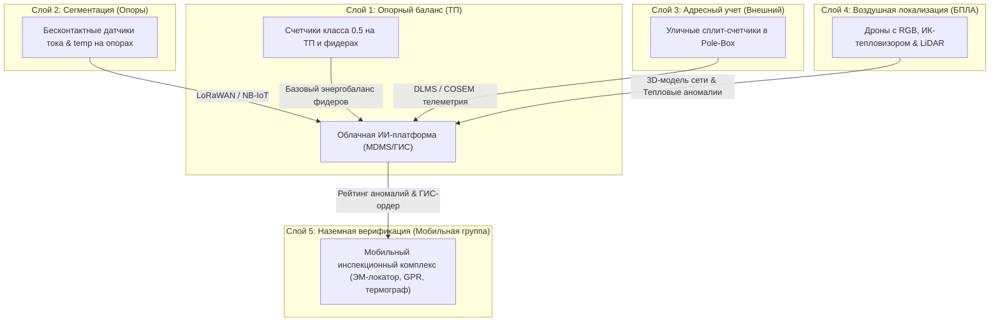

# Государственная программа «Цифровой суверенитет и энергобезопасность распределительных сетей»
## Концепция неинвазивного распределенного контроля и локализации коммерческих потерь (NTL) в районах с ограниченным доступом

> [!IMPORTANT]
> Настоящий документ представляет собой комплексное концептуальное предложение (Research & Design Proposal) для Правительства и профильных министерств энергетики. Предлагается поэтапное внедрение многоуровневой системы внешнего контроля, позволяющей локализовать хищения электроэнергии без установки счетчиков в жилых домах и исключающей необходимость входа инспекторов на частную территорию.

---

## 1. Суть государственного вызова и фундаментальный сдвиг концепции

Традиционные методы борьбы с нетехническими потерями (Non-Technical Losses, NTL) на базе бытовых счетчиков (AMI/Smart Metering) неработоспособны в целевых зонах из-за:
1. **Отсутствия приборов учета** у большинства потребителей (потребление по заниженным «нормативам» или прямые незаконные подключения).
2. **Физической недоступности и рисков безопасности:** Ввод инспекторов в криминогенные или социально сложные районы несет прямую угрозу здоровью персонала.
3. **Хаотичной топологии воздушных и подземных линий:** Массовые набросы, скрытые подземные отпайки, скрутки и мошенничество до точек потенциального учета.

**Ключевой сдвиг в стратегии:** Программа переводит фокус с контроля *внутри домов* на **внешний распределенный контроль физических параметров сети** на границах балансовой принадлежности. Сеть оцифровывается в виде высокоточного «цифрового двойника», последовательно снижая уровень неопределенности:  
`Отпуск с подстанции (ТП) ➔ Секции фидера ➔ Опоры (столбы) ➔ Групповые ответвления ➔ Конкретные адреса.`

---

## 2. Архитектура многоуровневой системы бесконтактного контроля

Для исключения ошибок первого рода (false positives) система проектируется как **5-слойный технологический каскад**:



### Детализация слоев архитектуры:

1.  **Слой 1. Опорный баланс (Upstream Reference):** Обязательный учет на трансформаторных подстанциях (ТП) и отходящих фидерах. Создает референсный профиль отпуска энергии. Без него невозможна фильтрация технических потерь.
2.  **Слой 2. Сегментация сети (Line Sensors):** Монтируемые без отключения напряжения (non-disruptive retrofit) датчики на фазах ВЛ (на базе **петель Роговского** или **Split-core CT** класса 0.5). Они замеряют ток по фазам, температуру проводника и фазовый угол на границах улиц или групп опор, сужая зону поиска хищения до пролета ЛЭП.
3.  **Слой 3. Адресный уличный учет (Pole-box Split Metering):** Применяется в стабильных зонах для легализации потребителей. Активная (измерительная) часть счетчика выносится на верхушку опоры в герметичный шкаф, а потребитель получает только дистанционный дисплей (CIU). Оборудование оснащается встроенными датчиками вскрытия (tamper alarms).
4.  **Слой 4. Воздушное зондирование (БПЛА с мультисенсорами):**
    *   *Тепловизоры (ИК):* Ночные полеты в часы пиковых хищений фиксируют нагрев проводов, скруток, перегретые вводы в дома и тепловой след подземных кабелей.
    *   *LiDAR (лазерное сканирование):* Строит 3D-модель проводов с точностью до 4-5 см, автоматически выявляя несогласованную геометрию и нелегальные отпайки.
5.  **Слой 5. Наземное дообследование (Last Mile Mobile Units):** Мобильный комплекс, оснащенный электромагнитными (ЭМ) локаторами и георадарами (GPR) для поиска скрытых подземных кабелей, бесконтактными измерителями качества электроэнергии (PQ) и портативными термографами для фиксации улик.

---

## 3. Метрология, параметры и аналитический комплекс

### Измерительный базис (Что измеряется и передается)
*   **Ток по фазам (I):** 1–5 мин телеметрия для построения балансов и локального Z-Score аномалий.
*   **Напряжение (U):** Анализ просадок (sag/swell) для выявления крупных потребителей.
*   **Фазовый угол и синхронизация по времени (IEEE 1588 / GPS):** Контроль топологической согласованности фаз.
*   **Температура проводников:** Косвенный признак плотности тока и скруток.
*   **Ток утечки (Residual current):** Детекция шунтирования нулевого провода.

Для обеспечения юридической силы измерений в судах балансовые приборы ориентированы на международные стандарты **IEC 61000-4-30 Class A** (ГОСТ IEC 61000-4-30-2017) и нормы гармоник **IEEE 519**.

### Каскадный ИИ-анализатор временных рядов (Anomaly Detection Pipeline)
Вместо непрозрачного "черного ящика" ИИ, платформа использует 4-х уровневый аналитический каскад:

| Этап анализа | Применяемый алгоритм / метод | Что решает | Требуемые входные данные |
| :--- | :--- | :--- | :--- |
| **1. Фидерный баланс** | Физический расчет потерь (разность временных рядов) | Выявление зон с аномальным расхождением отпуска и полезного отпуска | Данные ТП, оценки технических потерь |
| **2. Сегментный Z-Score** | Статистическое сравнение профилей нагрузки смежных сегментов | Локализация аномального потребления до конкретной улицы | Телеметрия сплит-датчиков опор |
| **3. Топологический граф** | Сверка с ГИС-графом сети (Graph Neural Networks) | Исключение ошибок коммутации и неактуальных схем | База ГИС, векторные данные ЛЭП, фазировка |
| **4. ML-ранжирование** | Обучение без учителя (Isolation Forest, DBSCAN) | Формирование приоритетного списка адресов для инспекции | Исторические профили, температурные карты, календарные признаки |

---

## 4. Спецификация оборудования и связи (RFI-ориентир)

Для реализации пилотного проекта закупается стек оборудования, исключающий проприетарную привязку к одному вендору (vendor lock-in):

*   **Датчики линий (Line Sensors):** Опорные датчики класса 0.5 на базе разъемных катушек Роговского (LEM, Janitza, Eaton) с автономным питанием от проходящего тока (line-powered) и резервной батареей.
*   **Концентраторы и связь:** endpoint-устройства используют сеть **LoRaWAN** (выделенная сеть энергокомпании) или **NB-IoT** (сеть сотовых операторов с покрытием до 164 dB MCL). Gateways и drone docks объединены в защищенный 4G/5G VPN-канал.
*   **Беспилотные комплексы:** Платформы промышленного класса (типа DJI Matrice 350 RTK / M30T) с тепловизионной камерой Zenmuse H30T (30 Hz thermal video) и LiDAR-модулем Zenmuse L2 (точность позиционирования до 4-5 см).
*   **Cybersecurity Baseline:** Строгое соответствие стандартам **NIST SP 800-213A** и **NISTIR 7628** (подписанные прошивки OTA, аппаратные чипы криптозащиты TPM, защищенные журналы аудита).

---

## 5. Дорожная карта и бюджет пилотного проекта (12 месяцев)

Рекомендуемый масштаб пилота: **3-5 фидеров, 8-20 распределительных трансформаторов, 60-120 опорно-сегментных точек, 1-2 летных экипажа БПЛА, 1 мобильная группа верификации.**

### Сводная смета пилота (Диапазон: $0.55M – $1.6M)

```
┌────────────────────────────────────────────────────────────────────────┐
│                        Бюджетные составляющие                          │
│                                                                        │
│  [Этап 1: Подготовка, аудит ГИС, правовая база] ──── $80k - $250k      │
│  [Этап 2: Закупка и монтаж датчиков ЛЭП] ────────── $150k - $450k     │
│  [Этап 3: Дроны, LiDAR, ИК-камеры, доки] ────────── $80k - $250k      │
│  [Этап 4: Наземный мобильный комплекс (GPR/ЭМ)] ─── $60k - $180k      │
│  [Этап 5: ИТ-платформа, ГИС-интеграция, ИИ] ──────── $150k - $400k     │
│  [Этап 6: Итоговый аудит, подготовка масштабирования] $30k - $80k      │
└────────────────────────────────────────────────────────────────────────┘
```

### График выполнения (Гант)

```
Период        | Q1 (Месяцы 1-3) | Q2 (Месяцы 4-6) | Q3 (Месяцы 7-9) | Q4 (Месяцы 10-12)
--------------|-----------------|-----------------|-----------------|------------------
Подготовка    | [=============] |                 |                 |                  
Монтаж ЛЭП    |                 | [=============] |                 |                  
Аэрокарты     |                 |   [===========] |                 |                  
Интеграция ИТ |                 | [=============================] |                  
Рейды & ИИ    |                 |                 | [=============] | [==============]
Аудит пилота  |                 |                 |                 |              [=]
```

---

## 6. Метрики успеха (KPI) пилотного проекта

Для защиты проекта перед Правительством используются жесткие, измеримые метрики:

1.  **Снижение небаланса по фидерам пилотной зоны:** Целевой показатель — **на 15-30%** за 12 месяцев.
2.  **Точность локализации (Alarm Precision):** Не менее **70%** генерируемых системой алармов должны подтверждаться при полевом/воздушном обследовании как реальное нарушение.
3.  **Радиус локализации (Median localization radius):** Менее **50 метров** от точки зафиксированной аномалии до фактического места отбора.
4.  **Полнота цифрового двойника сети:** Достижение **>90%** соответствия ГИС-модели реальному состоянию ЛЭП в пилотной зоне.
5.  **Операционная скорость:** Время от формирования аналитического алерта до вылета дрона или выезда группы — **менее 72 часов**.

---

## 7. Ключевые рекомендации для защиты перед Правительством

1.  **Создать нормативно-правовую рамку "Внешнего баланса" (Legal Annex):**
    Утвердить статус аэрофотосъемки и бесконтактных измерений со столба как достаточных оснований для проведения комплексных проверок. Разработать процедуру безопасного отключения на столбе (вне территории частного домовладения).
2.  **Задействовать модель государственного софинансирования (TOTEX/PPP):**
    Подать программу не как локальный проект энергокомпании, а как государственную программу инфраструктурного оздоровления (по аналогии с индийской RDSS). Правительство финансирует «видимость сети» (фидеры, ТП, ИИ, БПЛА), а операторы сетей снижают коммерческие потери, что в долгосрочной перспективе сдерживает рост тарифов для населения.
3.  **Обеспечить этический баланс (Легализационный контур):**
    Конечная цель проекта — не карательные рейды, а легализация. Выявленных нарушителей в стабильных зонах необходимо переводить на социальный тариф с одновременным выносом учета в антивандальные уличные шкафы (опыт ЮАР). Это снизит социальное напряжение и предотвратит повторный саботаж.
