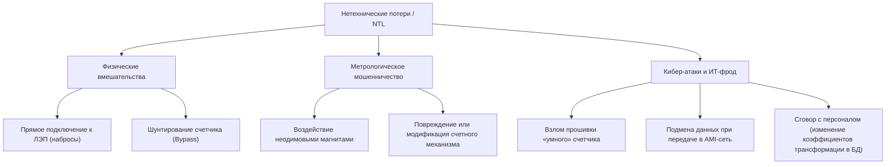

# Анализ зарубежного рынка систем борьбы с кражами электроэнергии и методов контроля

> [!NOTE]  
> В международной практике кража электроэнергии и мошенничество с приборами учета классифицируются как **коммерческие или нетехнические потери** (*Non-Technical Losses, NTL*). Глобальный рынок систем обнаружения NTL оценивается в $3.2 млрд (2024 г.) и, по прогнозам, вырастет до $9.1 млрд к 2033 году с ежегодным темпом роста (CAGR) около 13.7%.

---

## 1. Способы хищения электроэнергии: Мировая классификация

Зарубежные энергокомпании разделяют хищения на три основные категории:



---

## 2. Технологические решения и ключевые вендоры

Рынок делится на комплексные решения от гигантов тяжелой индустрии (Tier-1) и специализированное программное обеспечение на базе искусственного интеллекта.

### Глобальные лидеры (Tier-1)

#### 1. Itron (США) — Лидер в области Edge AI
* **Продукт:** *Itron Revenue Assurance* на платформе *Distributed Intelligence (DI)*.
* **Технология:** Анализ данных происходит **прямо на процессоре счетчика (edge computing)** с частотой 1 раз в секунду, а не раз в сутки на сервере.
* **Возможности:**
  * Мгновенное выявление шунтирования (bypass) за счет локального замера полного сопротивления петли фаза-ноль.
  * Библиотека из 100+ встроенных сигнатур и паттернов мошенничества.
  * Передача сигналов тревоги по высокоскоростным Mesh-сетям в течение нескольких секунд после инцидента.

#### 2. Siemens (Германия) — Корпоративный аналитический хаб
* **Продукт:** *Gridscale X Meter Data Management* (ранее *EnergyIP Revenue Protection*).
* **Технология:** Централизованная аналитическая платформа на стороне сервера (MDM), объединяющая миллиарды транзакций.
* **Возможности:**
  * Использование глубокого обучения (Deep Learning) для классификации потребителей на «честных» и «подозрительных».
  * Интеграция с диспетчерскими системами (SCADA, ADMS) для сопоставления баланса энергии на подстанции с суммой показаний клиентов.
  * Автоматический сквозной воркфлоу: от детекции аномалии до формирования наряда инспектору и контроля юридического взыскания.

#### 3. Landis+Gyr (Швейцария) — Баланс сети и картография
* **Продукт:** *Advanced Grid Analytics (Revenue Protection Module)*.
* **Технология:** Предиктивный статистический анализ и геоинформационные системы (ГИС).
* **Возможности:**
  * Выявление краж до прибора учета путем автоматического сопоставления нагрузки на распределительном трансформаторе и подключенных к нему потребителей.
  * Интеграция с картами для построения тепловых карт коммерческих потерь.
  * Учет внешних факторов (погода, сезонность, праздничные дни) для снижения ложноположительных срабатываний.

---

## 3. Сравнительный анализ технологических платформ

| Параметр | Itron | Siemens Gridscale X | Landis+Gyr | Bidgely (AI-стартап) |
| :--- | :--- | :--- | :--- | :--- |
| **Архитектура** | Распределенная (Edge AI) | Централизованная (Cloud/On-Prem) | Гибридная (Облачная ГИС) | SaaS (Облачная AI-платформа) |
| **Скорость реакции** | Мгновенно (секунды) | Средняя (от часов до суток) | Средняя (сутки) | Низкая (периодический батч-анализ) |
| **Глубина анализа** | Физические аномалии на уровне кабеля | Поведенческие аномалии, профили нагрузки | Топологические балансы сети, ГИС-анализ | Дезагрегация приборов в доме (NIALM) |
| **Снижение ложных тревог**| Высокое (за счет аппаратных датчиков) | Очень высокое (обучение на исторических данных) | Среднее (зависит от точности схемы сети) | Высокое (индивидуальные профили приборов) |

---

## 4. Государственное регулирование и методы контроля

За пределами СНГ контроль потерь выстроен через комбинацию экономических стимулов для сетей и неотвратимости жесткого наказания для расхитителей.

```
┌────────────────────────────────────────────────────────┐
│               Мировые модели контроля                 │
└───────────────────────────┬────────────────────────────┘
                            │
        ┌───────────────────┴───────────────────┐
        ▼                                       ▼
 ┌──────────────┐                        ┌──────────────┐
 │ Экономические│                        │ Юридические  │
 │   стимулы    │                        │   санкции    │
 └──────┬───────┘                        └──────┬───────┘
        │                                       │
        ├─ Нормативы потерь регулятора          ├─ Специальные суды (Индия)
        │  (Бразилия/ANEEL)                     │
        ├─ Инвестиционные тарифы на AMI         ├─ Лишение свободы до 5 лет
        │                                       │
        └─ Субсидии малоимущим                  └─ Гражданские иски на миллионы
           (Социальный тариф)                      (США/ЕС)
```

### США и Европейский Союз: Технологический надзор и жесткие иски
> [!IMPORTANT]  
> В развитых странах уровень коммерческих потерь минимален (1-3%). Основные риски связаны с несанкционированным использованием сети для теневого бизнеса (майнинг, выращивание каннабиса) или кибератаками на инфраструктуру.

* **100% AMI-покрытие:** Государственные регуляторы (например, PUC в США) обязуют сетевые компании устанавливать умные приборы учета. Вскрытие корпуса счетчика или воздействие магнитом мгновенно отправляет сигнал тревоги диспетчеру.
* **Гражданско-правовые последствия:** Вместо долгих уголовных разбирательств коммунальные службы подают крупные гражданские иски, включающие:
  * Расчет потребления по максимальной мощности за весь период нарушения.
  * Стоимость проведения экспертизы и работы инспекционной группы.
  * Штрафы за создание угрозы пожарной безопасности для соседей.
* **Кибербезопасность:** Кража данных приборов учета приравнивается к федеральным преступлениям против критической инфраструктуры.

### Индия: Специальные энергетические суды и рейды
В некоторых штатах Индии нетехнические потери исторически достигали 30-40% из-за массовых набросов на воздушные линии и коррупции.
* **Закон об электроэнергетике (Electricity Act, 2003):**
  * Четко криминализует любые виды обхода счетчиков (ст. 135).
  * **Санкции:** Тюремное заключение до **3 лет** за первое нарушение и до **5 лет** за повторное. Штрафы достигают 5-кратного размера от суммы похищенного.
* **Специальные энергетические суды (Special Courts):** Созданы для того, чтобы дела о краже электроэнергии рассматривались в течение нескольких недель, минуя общую перегруженную судебную систему.
* **Полномочия инспекторов:** Разрешено беспрепятственное проведение рейдов, изъятие подозрительных устройств и **немедленное отключение** абонента от сети без предварительного уведомления при обнаружении признаков кражи.

### Бразилия: Борьба с бедностью и тарифное стимулирование
Бразилия столкнулась с проблемой массовых незаконных подключений («gatos») в фавелах. Страна применила комплексный подход:
* **Давление регулятора (ANEEL):** Государственный регулятор рассчитывает эффективный уровень коммерческих потерь для каждого региона. Если сетевая компания допускает потери выше нормы, она обязана покрывать их из своей прибыли (запрещено перекладывать сверхнормативные потери в тариф). Это заставляет инвесторов вкладывать средства в умный учет.
* **Социальный тариф (Tarifa Social de Energia Elétrica):** Скидки на электроэнергию до 65% для малоимущих семей. Это переводит потребителей из категории нарушителей в категорию легальных плательщиков, снижая социальную напряженность.
* **Технологические барьеры:** Массовый вынос приборов учета на верхушки опор ЛЭП в антивандальные шкафы с передачей показаний по беспроводным каналам.

---

## 5. Идеи для развития нашего Детектора Краж (Theft Detector Dashboard)

На основе лучших мировых практик мы можем расширить функционал нашего симулятора и аналитического модуля:

1. **Моделирование баланса фаз и трансформатора (Landis+Gyr подход):**
   * Добавить в симулятор виртуальную «Трансформаторную подстанцию» и несколько домов.
   * Показывать, как утечка (наброс до счетчика) в одном из домов создает дисбаланс между отпуском ТП и суммой счетчиков.

2. **Симуляция Edge-событий умного счетчика (Itron подход):**
   * Добавить триггеры событий: `Tamper Alert` (вскрытие корпуса), `Magnetic Field Detected` (магнитное поле), `Phase Loss` (пропадание фазы).
   * Показать, как система мгновенно реагирует на физические действия пользователя.

3. **Интерактивная карта потерь (ГИС):**
   * Визуализировать карту сети с цветовой индикацией уровня потерь (зеленый — ок, красный — высокая вероятность кражи).
